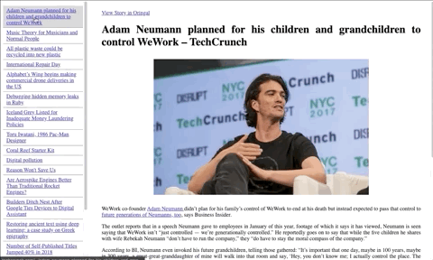

# Hacker News Reader

A portal to read Hacker News in Reader Mode. Saving data, saving you from distraction.

### Technical Stack:

- NextJS
- TypeScript
- jsdom
- Readability.js
- styled-components
- Material UI
- React-Redux

### Development Practices/Tools

- Prettier
- husky
- ESLint
- typescript-eslint
  - Leverage existing Linting tools and rules based on JS in TypeScript

  

  

